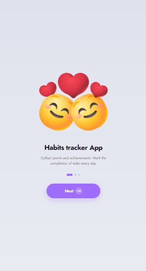
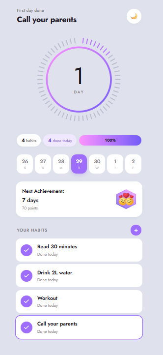
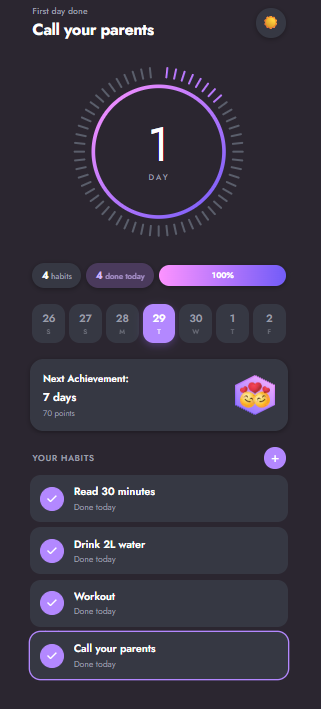
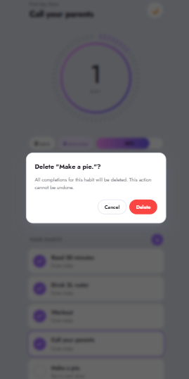

# Habit Tracker


A minimal, dark-first habit tracker with streaks, achievements, and a month calendar. Built with **Next.js 16**, **React 19**, **TypeScript**, and **Zustand**.

---

## Screenshots

### Onboarding



### Light theme



### Dark theme




---

## Features

- **Onboarding** — 3-slide intro with PNG art, shown only on the first visit
- **Two themes** — light and dark, FOUC-free hydration via inline script + Zustand `persist`
- **Streak dial** — Apple Watch-style segmented dial with gradient ring and glow
- **Habit list** — one row per habit, tap the check to mark done
- **Quick stats** — total habits, done today, completion progress bar
- **Week strip** — 7-day rolling window around today, today highlighted
- **Achievements** — next milestone card with 3D badge art
- **Month calendar** — expandable per habit, navigable months, today highlighted
- **Confirm dialog** — native `<dialog>` for deletion
- **Keyboard accessible** — Enter/Space to toggle, Esc to close dialog, ARIA labels
- **Reduced motion** — respects `prefers-reduced-motion`

---

## Tech Stack

| Layer | Tech |
|---|---|
| Framework | Next.js 16 (App Router) |
| UI | React 19 |
| Language | TypeScript (strict) |
| State | Zustand 5 + `persist` (`skipHydration`, manual `rehydrate`) |
| Styling | CSS Modules + CSS variables (two themes) |
| Fonts | Jost (via `next/font/google`) |
| Icons | lucide-react |
| Tests | Vitest + Testing Library + jsdom |
| CI | GitHub Actions (lint · typecheck · test · build) |

---

## Architecture Decisions

### One route, many states

Habit Tracker has **one URL**: `/`. Everything else — onboarding, main screen, expanded habit, open modal — is **local UI state** (Zustand or `useState`). This is intentional:

- No auth → no route groups.
- No server data → no `fetch`, no Server Actions.
- No sharing → no URL-driven state (except theme, which persists in `localStorage`).

This keeps the app small and fast. **Adding routes** would mean adding **page-level concerns** (loading, error, metadata) that don't apply here.

### Zustand with `skipHydration`

The app is client-only, but Next.js still renders it on the server first. `localStorage` is unavailable on the server — a naive `useState(() => localStorage.getItem(...))` causes **hydration mismatch**.

The pattern used everywhere:

1. `persist(..., { skipHydration: true })` — store is created **empty** on both server and client.
2. `mounted` is read via `useSyncExternalStore` — `false` on server, `true` on client.
3. Until `mounted`, the UI renders a **placeholder**.
4. After mount, `useHabitsStore.persist.rehydrate()` reads `localStorage` once.

This is the **standard SSR-safe pattern** for client state in Next.js. No `setState` in `useEffect` (React 19 warns about that), no hydration mismatch.

### Two themes, no FOUC

The theme (light/dark) is stored in Zustand + `persist`. To avoid a flash of the wrong theme:

- An **inline `<script>` in `<head>`** reads `localStorage` **before** the first paint and sets `data-theme` on `<html>`.
- `ThemeApplier` syncs the store → DOM **after** mount (only if the user toggles).

Result: no flicker on load, no hydration mismatch.

### UTC everywhere

All dates are **UTC strings** (`YYYY-MM-DD`). Functions use `getUTCFullYear` / `getUTCMonth` / `getUTCDate`, never local variants. Formatting uses `Intl.DateTimeFormat` with an explicit `timeZone`.

Why: mixing local and UTC in a calendar or streak calculation produces off-by-one-day bugs that only show up around midnight in some timezone. UTC everywhere is boring but correct.

### Pure logic in `lib/`

`habits.ts` and `date-utils.ts` contain **only pure functions**. No React, no Zustand, no side effects. This makes them:

- Trivial to test (see below).
- Reusable on the server (if we ever add SSR).
- Easy to reason about (input → output).

---

## Testing

```bash
npm test              # watch mode
npm run test:run      # single run
npm run test:coverage # coverage report
```

Coverage targets: **100% statements** for `lib/` and `stores/`, **80%+ branches**.

## Roadmap

### UX
- [ ] Habit icons (emoji / PNG) — currently text-only
- [ ] Swipe to delete a habit row
- [ ] Drag to reorder habits
- [ ] Roving tabindex for the calendar (WAI-ARIA grid pattern)
- [ ] Toast after delete (undo instead of confirm dialog)
- [ ] Import / export JSON
- [ ] Weekly / monthly statistics view

### Architecture
- [ ] IndexedDB for larger datasets
- [ ] Optional backend sync (auth + cloud)
- [ ] Habit categories and tags
- [ ] Web Notifications for daily reminders

### Testing
- [ ] E2E test for the full flow — Playwright
- [ ] Visual regression tests
- [ ] Coverage gate in CI (>80%)

---

## Author

**Marina Dev** — Fullstack Developer  
GitHub: [@marinaburyakova](https://github.com/marinaburyakova)  
Portfolio: [portfolio.mint-apps.com](https://portfolio.mint-apps.com)
