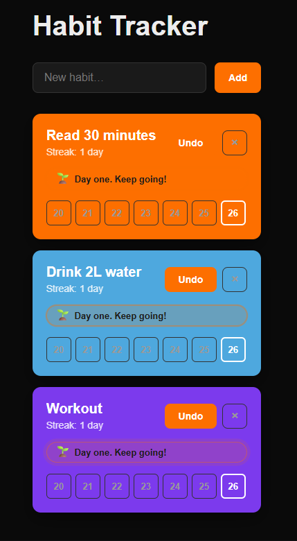

# Habit Tracker

A personal habit tracker built with **Next.js 16**, **React 19**, and **TypeScript**.

Track daily habits, build streaks, and stay motivated with milestone badges.



## Features

- **Track habits** — create, complete, and delete habits
- **Weekly grid** — mark any of the last 7 days
- **Streak tracking** — current streak with soft recovery (a missed day doesn't reset until tomorrow)
- **Motivation badges** — milestones at 1, 2, 3, 5, 7, 14, 30 days
- **Cascade delete** — removing a habit removes all its completions
- **Accessibility** — ARIA attributes, `prefers-reduced-motion` support
- **Dark theme** — comfortable for daily use

## Tech Stack

| Layer        | Tech                       |
| ------------ | -------------------------- |
| Framework    | Next.js 16 (App Router)    |
| UI           | React 19                   |
| Language     | TypeScript (strict)        |
| Styling      | CSS Modules                |
| Architecture | Server + Client Components |

## Project Structure

```
src/
  app/
    layout.tsx              # Root layout
    page.tsx                # Server Component — static shell
    globals.css             # Global styles
  components/
    HabitTrackerClient.tsx  # Client Component — state + logic
    HabitList.tsx           # Renders list of habits
    HabitItem.tsx           # Single habit card
    WeekGrid.tsx            # 7-day grid
    MotivationBadge.tsx     # Milestone badge
    AddHabitForm.tsx        # New habit form
    Button.tsx              # Reusable button
  lib/
    habits.ts               # Pure functions — all business logic
```

## Architecture Decisions

### Server vs Client Components

`page.tsx` is a **Server Component** — it renders the static shell (`<h1>`, layout) on the server.

`HabitTrackerClient` is the **only** Client Component boundary. Everything below it is client too. This keeps JS bundle small and the initial HTML server-rendered.

### Pure functions in `lib/habits.ts`

All business logic lives in **pure, testable functions**:

- `formatDate`, `parseDate`, `daysBetween` — date utilities (UTC-based)
- `addCompletion`, `removeCompletion`, `toggleCompletion` — immutable state updates
- `calculateStreak`, `longestStreak`, `getCompletionRate` — analytics
- `getMotivation` — milestone messages

These functions **never mutate** their inputs. React can rely on reference equality to detect changes.

### Soft streak

If you complete a habit today, streak counts today. If you miss today but completed yesterday, streak stays alive until end of day — no accidental reset.

## Getting Started

### Prerequisites

- Node.js 20+
- npm or pnpm

### Install

```bash
git clone <repo-url> habit-tracker
cd habit-tracker
npm install
```

### Development

```bash
npm run dev
```

Open [http://localhost:3000](http://localhost:3000).

### Build

```bash
npm run build
npm start
```

## What's Next

- [ ] Persist data in `localStorage`
- [ ] Migrate to PostgreSQL + Prisma
- [ ] Yearly heatmap view
- [ ] Analytics dashboard
- [ ] Light / dark theme toggle
- [ ] PWA for offline use

## Author

**Marina Dev** — Fullstack Developer

- GitHub: [@marinaburyakova](https://github.com/marinaburyakova)
- Portfolio: [mint-apps.com](https://mint-apps.com)

## License

MIT
